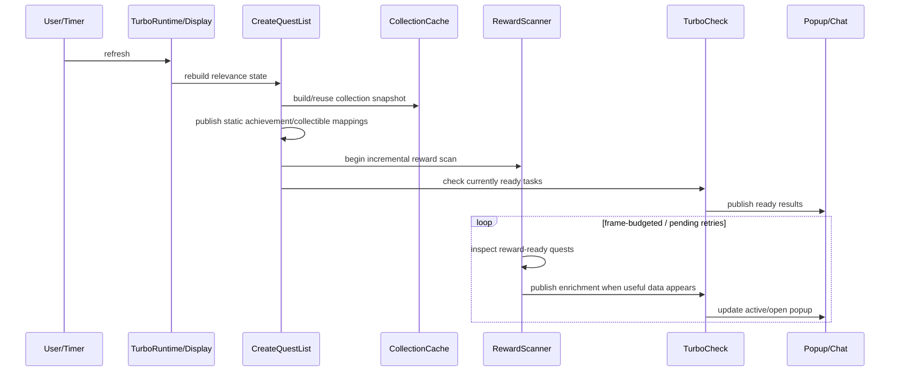

# Architecture

## 1. Architectural style

WQA Turbo is best described as a **compatibility core with layered performance overrides**.

The project inherited substantial logic and data structures from WQAchievements. Instead of replacing every path at once, WQA Turbo retains compatible helpers and data mappings while loading specialized modules afterward that replace expensive runtime behavior.

That gives the project two important properties:

- mature compatibility/data logic can remain stable;
- performance-sensitive orchestration can evolve independently.

It also means maintainers must understand **load order and method replacement**.

## 2. Load order

The TOC loads the addon approximately in this order:

```text
embedded libraries
Core.lua
Constants.lua
TrackingPolicy.lua

DB/Data/*
DB/Expansions.lua
DB/Zones.lua
DB/RuntimeData.lua

Criterias/*
Rewards/*
Items/*

Achievements.lua
Locales.lua
Utilities.lua
Tooltip.lua
Migration.lua

WQATurbo.lua

CollectionCache.lua
RewardScanner.lua
TurboRuntime.lua
TurboDisplay.lua
TurboCheck.lua
Performance.lua

Options.lua
```

The exact TOC is the authority.

### Why load order matters

Lua method assignment is mutable. If `WQA:CheckWQ()` is defined in `WQATurbo.lua` and then defined again in `TurboCheck.lua`, the later implementation is the one used at runtime.

The same principle applies to optimized reward scanning, runtime startup, display and collection behavior.

### Debugging rule

Before patching a function:

1. search the entire repository for every definition/assignment of that function;
2. inspect `WQATurbo.toc`;
3. identify which implementation is loaded last;
4. patch the runtime owner unless the change intentionally belongs in a shared helper.

This prevents fixes from being added to an implementation that is no longer active.

## 3. Module ownership

### `Core.lua`

Creates the AceAddon object and the basic namespaces/tables.

Conceptually:

```lua
WQATurbo = LibStub("AceAddon-3.0"):NewAddon(
    "WQATurbo",
    "AceConsole-3.0",
    "AceTimer-3.0"
)
```

It establishes shared state such as:

- `WQA.data`
- `WQA.questList`
- `WQA.missionList`
- `WQA.itemList`
- watched-task sets
- criteria namespace
- reward namespace

### `Constants.lua` and `TrackingPolicy.lua`

`Constants.lua` owns `WQA.Constants.RewardType`, `CriteriaType`, `TaskType` and
`TrackingMode`. Their string values remain compatible with content data and
SavedVariables. The existing reward/criteria enum modules expose aliases to
these same tables without replacing the namespaces created by `Core.lua`.

`TrackingPolicy.lua` owns mode eligibility/force flags, ordinary bulk-mode
eligibility and mode/owner writes. Achievements, collectible registration and
Settings reuse these helpers. Collection/criterion completion checks stay in
their existing runtime owners; refresh scheduling stays in Settings.

### `DB/Data/*.lua`

Declarative expansion-specific mappings.

Typical data includes:

- achievements and their quest/POI/mission criteria;
- mounts;
- pets;
- toys;
- faction restrictions;
- special criterion metadata.

These files should contain data, not scanner architecture.

### `DB/Expansions.lua`

Maps WQA internal expansion indexes to Blizzard expansion names.

Current relevant indexes:

```text
6  Warlords of Draenor
7  Legion
8  Battle for Azeroth
9  Shadowlands
10 Dragonflight
11 The War Within
12 Midnight
```

### `DB/Zones.lua`

Maps expansion index to the map IDs scanned for World Quests.

This is a major scanner input: enabled maps are derived from this data plus profile zone settings.

### `DB/RuntimeData.lua`

Owns stable lookup metadata shared by runtime and Settings code:

- currency IDs by expansion;
- reputation faction IDs by expansion and player faction;
- emissary quest IDs by expansion and player faction;
- localized World Quest type labels mapped to Blizzard enum values.

It loads before `Utilities.lua`, `WQATurbo.lua` and `Options.lua` so none of
those consumers depends on Settings initialization. `WQA.EmissaryQuestIDList`
remains an alias to the canonical emissary table for compatibility.

### `Achievements.lua`

Converts declarative achievement definitions into actual tracked relevance.

Supported patterns include:

- single quest;
- groups/alternatives of quests;
- nested achievements;
- quest flags;
- quest-line/pin criteria;
- Area POIs;
- mission-table criteria;
- special wide-world-of-quests logic.

### `Rewards/Reward.lua`

Canonical reward merge layer.

All paths should converge on `AddReward()` / `AddRewardToQuest()` rather than building ad-hoc reward tables.

This is important because multiple reasons can make the same quest relevant.

For example, one quest can be:

- achievement-relevant;
- an uncollected transmog source;
- a configured reputation reward.

The reward merge layer combines these into one task instead of producing duplicate tasks.

### `WQATurbo.lua`

Large compatibility/core module.

Responsibilities include:

- AceDB defaults and initialization;
- migration handoff before AceDB opens;
- shared reward classification (`CheckItems`, `CheckReward`);
- gear/cache/transmog classification;
- reputation item/currency mappings;
- custom task helpers;
- mission-table logic;
- minimap data object;
- miscellaneous utility behavior;
- compatibility implementations later superseded by Turbo modules.

Do not assume every major runtime method defined here remains authoritative after all modules load.

### `CollectionCache.lua`

Optimizes collection access.

Instead of repeatedly asking the mount/pet journals while walking each
expansion's data, collection state is indexed once per refresh and reused.
Settings completion grouping reads the same ownership indexes, so constructing
one row per tracked mount or pet does not rescan the corresponding journal.

### `RewardScanner.lua`

Owns the optimized dynamic World Quest reward scan.

Key design principles:

- frame-budgeted initial scan;
- per-quest pending state;
- asynchronous reward data does not trigger a global rescan;
- retry only unresolved quests;
- progressively publish newly ready dynamic relevance.

### `TurboRuntime.lua`

Owns optimized runtime orchestration.

It avoids the old startup behavior that synchronously preloaded/scanned every map and provides the modern `/wqat` command flow.

### `TurboDisplay.lua`

Separates **display cached results** from **explicit refresh**.

This is central to WQA Turbo's responsiveness:

- `/wqat` and ordinary popup opening use current cached results;
- `/wqat refresh` explicitly rebuilds/rescans;
- open popup contents are rebuilt as enrichment arrives.

### `TurboCheck.lua`

Owns optimized readiness and final task publication.

It converts `questList` relevance into ready `activeTasks`/`newTasks`, while:

- applying final task eligibility;
- resolving links;
- allowing ready quests through even when another quest is waiting on data;
- scheduling coalesced readiness retries.

### `Tooltip.lua`

Owns LibQTip creation, layout, scrolling, expansion collapsing and safe popup release/rebuild.

### `Options.lua`

Builds the AceConfig settings hierarchy.

Settings are largely generated dynamically from:

- expansion data;
- zone lists;
- collection definitions;
- reward lists;
- profession mappings;
- reputation, currency, emissary and World Quest type metadata from
  `WQA.RuntimeData`.

### `Migration.lua`

Handles import from original WQAchievements and must run early enough to copy raw SavedVariables before AceDB turns them into live DB objects.

### `Performance.lua`

Collects timing/counter diagnostics used by `/wqat perf` and related diagnostics.

## 4. Primary refresh lifecycle

An explicit refresh conceptually performs:



### Static relevance

Static data is known from addon tables and collection state.

Examples:

- a quest that is required for an unfinished achievement;
- a mount/pet/toy mapping whose collectible is unowned.

Static relevance can be added immediately.

### Dynamic relevance

Dynamic relevance depends on Blizzard reward APIs.

Examples:

- transmog;
- gear;
- recipe;
- gold;
- currencies;
- reputation;
- reward containers.

This data may not be ready when the refresh starts.

The incremental scanner enriches the static result set later.

## 5. Display versus refresh

WQA Turbo intentionally distinguishes these operations.

### Display cached results

Examples:

- `/wqat`
- ordinary minimap left-click
- `/wqat popup`

These should be fast and must not implicitly trigger a broad rebuild.

### Explicit refresh

Examples:

- `/wqat refresh`
- setting changes through the debounced settings refresh
- 1.1.0 Shift+Left-click minimap behavior

A refresh rebuilds relevance and starts a dynamic scan.

### 1.1.0 Shift+Left-click

The order is deliberately:

```text
open cached popup
then start silent refresh
```

This gives immediate feedback, while the already-open popup can progressively update as the scan finishes.

## 6. Final eligibility is separate from relevance

A quest can be relevant in `questList` and still not be displayable.

Final publication checks include:

- quest activity;
- enabled World Quest type;
- War Mode behavior;
- zone enable/disable setting;
- emissary/pin/quest-flag activity where applicable;
- link/readiness state.

This separation matters because static mappings can identify a quest before the dynamic scanner touches it.

The final gate prevents static relevance from bypassing disabled-zone or World Quest-type settings.

## 7. Persistent popup architecture

The persistent popup is LibQTip-based and:

- scrolls after reaching an approximate 60% UI-height cap;
- supports per-expansion collapse state;
- is rebuilt when progressive enrichment changes active results;
- can remember position depending on profile setting.

### Tooltip race invariant

Delayed callbacks must never release a newer tooltip instance.

The safe pattern is:

1. capture the exact tooltip instance;
2. delayed callback verifies `WQA.tooltip == captured`;
3. set `WQA.tooltip = nil` before releasing;
4. clear attached task collections;
5. release via LibQTip;
6. cleanup must be idempotent.

See [INVARIANTS_AND_REGRESSION_GUARDS.md](INVARIANTS_AND_REGRESSION_GUARDS.md).

## 8. External libraries and integrations

Embedded through `.pkgmeta` / `embeds.xml`:

- AceAddon
- AceConfig
- AceConsole
- AceDB
- AceDBOptions
- AceGUI
- AceTimer
- CallbackHandler
- LibDataBroker
- LibDBIcon
- LibQTip
- LibStub

Optional integrations:

- WQAchievements — migration source only;
- AllTheThings — transmog status icon presentation;
- CanIMogIt — transmog status icon presentation;
- Pawn — optional upgrade scoring;
- StatWeightScore — optional upgrade scoring.

Blizzard transmog APIs remain authoritative for collection state.
