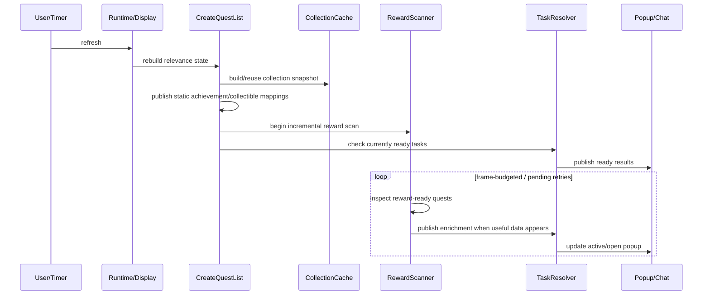

# Architecture

## 1. Architectural style

WQA Turbo is best described as a **compatibility core with specialized runtime modules**.

The project inherited substantial logic and data structures from WQAchievements.
WQA Turbo retains compatible helpers and data mappings while specialized
modules own performance-sensitive runtime behavior.

That gives the project two important properties:

- mature compatibility/data logic can remain stable;
- performance-sensitive orchestration can evolve independently.

It also means maintainers must understand **load order, ownership and
instrumentation**.

## 2. Load order

The TOC loads the addon approximately in this order:

```text
embedded libraries
Core.lua
Constants.lua
Tracking/TrackingPolicy.lua

Data/Expansions/*
Data/Expansions.lua
Data/Zones.lua
Data/RuntimeData.lua
Data/ShadowlandsCallings.lua
Data/ContainerCollectibles.lua

Tracking/ContainerCompletion.lua

Criterias/*
Rewards/*
Items/*

Tracking/Achievements.lua
Locales.lua
Utilities.lua
UI/Tooltip.lua
Migration.lua
Database.lua

WQATurbo.lua

Tracking/CollectionCache.lua
Tracking/Custom.lua
Tracking/Callings.lua
Tracking/QuestAvailability.lua
Scanning/WorldBossScanner.lua
Scanning/RewardScanner.lua
Scanning/EmissaryScanner.lua
Runtime/Runtime.lua
Runtime/Display.lua
Runtime/TaskResolver.lua
Performance.lua

UI/Options/Shared.lua
UI/Options/Custom.lua
UI/Options/Tracking.lua
UI/Options/Rewards.lua
UI/Options.lua
```

The exact TOC is the authority.

### Why load order matters

Step 8 consolidated the major runtime methods to one source owner each. Load
order still supplies every owner's dependencies, and `Performance.lua` wraps
selected methods after those owners load.

### Debugging rule

Before patching a function:

1. search the entire repository for every definition/assignment of that function;
2. inspect `WQATurbo.toc`;
3. confirm its sole runtime owner and loaded dependencies;
4. patch the owner unless the change intentionally belongs in a shared helper.

This prevents duplicate ownership and changes that bypass required setup or
instrumentation.

## 3. Module ownership

### `Core.lua`

Creates the AceAddon object and the basic namespaces/tables.

Conceptually:

```lua
WQATurbo = LibStub("AceAddon-3.0"):NewAddon(
    "WQATurbo",
    "AceConsole-3.0",
    "AceTimer-3.0"
)
```

It establishes shared state such as:

- `WQA.data`
- `WQA.questList`
- `WQA.missionList`
- `WQA.itemList`
- watched-task sets
- criteria namespace
- reward namespace

### `Constants.lua` and `Tracking/TrackingPolicy.lua`

`Constants.lua` owns `WQA.Constants.RewardType`, `CriteriaType`, `TaskType` and
`TrackingMode`. Their string values remain compatible with content data and
SavedVariables. The existing reward/criteria enum modules expose aliases to
these same tables without replacing the namespaces created by `Core.lua`.

`Tracking/TrackingPolicy.lua` owns mode eligibility/force flags, ordinary bulk-mode
eligibility and mode/owner writes. Achievements, collectible registration and
Settings reuse these helpers. Collection/criterion completion checks stay in
their existing runtime owners; refresh scheduling stays in Settings.

### `Data/Expansions/*.lua`

Declarative expansion-specific mappings.

Typical data includes:

- achievements and their quest/POI/mission criteria;
- mounts;
- pets;
- toys;
- faction restrictions;
- special criterion metadata.

These files should contain data, not scanner architecture.

### `Data/Expansions.lua`

Maps WQA internal expansion indexes to Blizzard expansion names.

Current relevant indexes:

```text
6  Warlords of Draenor
7  Legion
8  Battle for Azeroth
9  Shadowlands
10 Dragonflight
11 The War Within
12 Midnight
```

### `Data/Zones.lua`

Maps expansion index to the map IDs scanned for World Quests.

This is a major scanner input: enabled maps are derived from this data plus profile zone settings.

### `Data/RuntimeData.lua`

Owns stable lookup metadata shared by runtime and Settings code:

- currency IDs by expansion;
- reputation faction IDs by expansion and player faction;
- emissary quest IDs by expansion and player faction;
- localized World Quest type labels mapped to Blizzard enum values;
- Val/Naigtal map IDs and the live weekly-rotation parity anchor.

It loads before `Utilities.lua`, `WQATurbo.lua` and `UI/Options.lua` so none of
those consumers depends on Settings initialization. `WQA.EmissaryQuestIDList`
remains an alias to the canonical emissary table for compatibility.

`Utilities.lua` owns `GetActiveValNaigtalMapID()` and
`IsMapCurrentlyAvailable()`. They prefer the localized live portal Area POI
on Voidstorm's map and use Blizzard's regional weekly-reset clock as fallback.
If both signals are unavailable or invalid, availability fails open so
uncertain World Quests remain eligible. The result is cached for 60 seconds to
keep final per-quest eligibility cheap.

### `Data/ShadowlandsCallings.lua`

Owns the verified 24-family mapping between the four covenant-specific quest
IDs for each Shadowlands daily Calling objective. It builds a reverse lookup
for the Calling tracker, supplies the four primary covenant-sanctum map IDs for
zone fallback, and loads before `Tracking/Callings.lua`.

### `Data/ContainerCollectibles.lua`

Owns fixed collectible outcome data for racing purses, Benthic armor tokens,
ordinary Azerite Armor Cache and verified equipment caches such as Zandalari
Empire Equipment Cache. It is loaded before
`Tracking/ContainerCompletion.lua` and the reward classifiers.

### `Tracking/ContainerCompletion.lua`

Resolves fixed-pool container completion with Blizzard's account quest and
transmog appearance APIs. It also rejects item-link contexts that do not use a
container's registered pool. It fails open when data is absent or a context is
unsupported so the classifier cannot hide a reward from an incomplete or
inapplicable lookup.

### `Tracking/Achievements.lua`

Converts declarative achievement definitions into actual tracked relevance.

Supported patterns include:

- single quest;
- groups/alternatives of quests;
- nested achievements;
- quest flags;
- quest-line/pin criteria;
- Area POIs;
- mission-table criteria;
- special wide-world-of-quests logic.

### `Rewards/Reward.lua`

Canonical reward merge layer.

All paths should converge on `AddReward()` / `AddRewardToQuest()` rather than building ad-hoc reward tables.

This is important because multiple reasons can make the same quest relevant.

For example, one quest can be:

- achievement-relevant;
- an uncollected transmog source;
- a configured reputation reward.

The reward merge layer combines these into one task instead of producing duplicate tasks.

### `WQATurbo.lua`

Large compatibility/core module.

Responsibilities include:

- AceDB defaults and initialization;
- migration handoff before AceDB opens;
- shared reward classification (`CheckItems`, `CheckReward`);
- focused local classifiers for containers, gear upgrades, equipment caches,
  transmog, reputation items, recipes, known/custom items and legacy gear;
- reputation item/currency mappings;
- custom task draft defaults;
- mission-table logic;
- minimap data object;
- miscellaneous utility behavior;
- the sole `CreateQuestList()` implementation, including collection-cache
  invalidation at the start of each rebuild.

`Tracking/Custom.lua` owns runtime registration for enabled user-defined World
Quests and missions. `Tracking/CollectionCache.lua` provides the invalidation helper, owns the
mount/pet snapshot implementation and registers static mount, pet and toy
sources. Consolidated runtime methods have one source owner.

`Tracking/Callings.lua` owns optional Shadowlands Calling registration.
`Runtime/Runtime.lua` forwards Calling, turn-in and covenant-change events.
The active covenant's payload identifies shared daily families; the tracker
expands those families into the selected covenant-specific variants. Observed
family expirations are global, per-character completion locks are retained only
through the same expiration, and covenant selections are profile settings.

`CheckReward()` owns item-link acquisition and retry aggregation. Its focused
classifiers decide what the resolved reward means and publish through
`AddRewardToQuest()`. They do not control scanner scheduling.

`Rewards/MatchReason.lua` reads the finished reward model and produces stable,
localized reason categories for popup task-name hover. It does not query
Blizzard APIs or participate in classification.

### `Tracking/CollectionCache.lua`

Optimizes collection access.

Instead of repeatedly asking the mount/pet journals while walking each
expansion's data, collection state is indexed once per refresh and reused.
Settings completion grouping reads the same ownership indexes, so constructing
one row per tracked mount or pet does not rescan the corresponding journal.
Mapped pet lookups cross-check an unowned journal row with the species count and
cache that result for the current snapshot.
The module is the sole owner of `AddMounts()`, `AddPets()` and `AddToys()`.
Only mounts and pets require journal snapshots; toys use Blizzard's direct
ownership query.

### `Tracking/Custom.lua`

Owns `AddCustom()` and registers enabled user-defined World Quests, Quest
Flags, Quest Pins and missions during each `CreateQuestList()` rebuild.

### `Tracking/Callings.lua`

Requests the active covenant's Calling data when the Shadowlands option is
enabled. Known IDs resolve to a shared daily family and register every selected
covenant's variant. Unmapped future IDs remain active-covenant only. Covenant
changes invalidate transient event state before requesting current data;
turn-in records a character-scoped completion through the observed expiration
and removes that variant immediately.

### `Tracking/QuestAvailability.lua`

Owns Quest Pin map readiness, request throttling and Quest Flag completion
checks. `Runtime/TaskResolver.lua` consumes its availability results without
querying each configured pin separately.

### `Scanning/RewardScanner.lua`

Owns the optimized dynamic World Quest reward scan, including the sole
`Reward()` implementation.

Key design principles:

- frame-budgeted initial scan;
- exclude the inaccessible Val/Naigtal destination before map discovery;
- per-quest pending state;
- asynchronous reward data does not trigger a global rescan;
- retry only unresolved quests;
- progressively publish newly ready dynamic relevance.

### `Scanning/WorldBossScanner.lua`

Owns opt-in World Boss Encounter Journal inspection. It resolves an active
World Boss quest to an encounter on the same map, prefers conservative pin
coordinate matching, and falls back to a unique localized quest-name or
objective-name match within the quest's expansion tier when Blizzard exposes no
map encounter pin. It filters loot to the active class and reuses the normal
transmog ownership helper. It skips completed encounters and preserves hidden
Adventure Guide selection, tier and loot-filter state. `RewardScanner` owns
when the helper runs and retains unresolved boss data as per-quest pending work.

### `Scanning/EmissaryScanner.lua`

Owns emissary discovery, reward readiness retries, timeout diagnostics and
quest-log activity checks. A generation token prevents a superseded refresh
from publishing stale emissary results.

### `Runtime/Runtime.lua`

Owns optimized runtime orchestration.
It is the sole owner of `OnEnable()` and its startup/event schedule.

It avoids the old startup behavior that synchronously preloaded/scanned every map and provides the modern `/wqat` command flow.

It registers `GARRISON_MISSION_LIST_UPDATE` without loading
`Blizzard_GarrisonUI`. Mission scanning uses the global `C_Garrison` API, while
Blizzard remains responsible for loading its mission-table frames when a
player opens that UI.

Since 1.3.0, the profile callback handles changed, copied and reset profiles.
It detaches the exact old tooltip, clears watched sets, rebinds LibDBIcon to the
current profile, and immediately rebuilds through `RefreshFromOptions(true)`.
This explicit user action bypasses automatic combat deferral to prevent showing
another profile's cache. The normal refresh sequence supersedes old scanner,
emissary and TaskResolver generations. Settings controls are then notified.

### `Runtime/Display.lua`

Separates **display cached results** from **explicit refresh**.
It is the sole owner of `Show()` and contains the canonical refresh sequence
used by `Refresh()` and the first-access cache fallback.

This is central to WQA Turbo's responsiveness:

- `/wqat` and ordinary popup opening use current cached results;
- `/wqat refresh` explicitly rebuilds/rescans;
- open popup contents are rebuilt as enrichment arrives.

### `Runtime/TaskResolver.lua`

Owns optimized readiness and final task publication, including the sole
`CheckWQ()` implementation.

It converts `questList` relevance into ready `activeTasks`/`newTasks`, while:

- applying final task eligibility;
- resolving links;
- allowing ready quests through even when another quest is waiting on data;
- scheduling coalesced readiness retries.

### `UI/Tooltip.lua`

Owns LibQTip creation, layout, scrolling, expansion collapsing and the canonical
release/rebuild lifecycle. `ReleaseQTip()` accepts only the exact currently
owned tooltip, detaches shared references before calling LibQTip and is
idempotent. `RebuildQTip()` is shared by popup enrichment, expansion collapse
and transient LDB rebuilding.

### `UI/Options.lua`

Orchestrates the AceConfig settings hierarchy and owns general settings, tab
organization and the single coalesced runtime refresh timer. Feature builders
load first in TOC order:

- `UI/Options/Shared.lua`: one ordering counter and sorted expansion IDs.
- `UI/Options/Custom.lua`: custom forms, validation and entry mutations.
- `UI/Options/Tracking.lua`: tracking trees, search and bulk changes; its separate
  label retry timer only notifies AceConfig when item metadata is missing.
- `UI/Options/Rewards.lua`: general and per-expansion reward pages.

All feature setters use the controller's refresh methods. The split preserves
AceConfig paths, labels and construction order.

Settings are largely generated dynamically from:

- expansion data;
- zone lists;
- collection definitions;
- reward lists;
- profession mappings;
- reputation, currency, emissary and World Quest type metadata from
  `WQA.RuntimeData`.

### `Migration.lua`

Handles import from original WQAchievements and must run early enough to copy raw SavedVariables before AceDB turns them into live DB objects.

### `Database.lua`

Owns the active `WQATurboDB` schema version and ordered migrations. It runs
after AceDB initialization and before runtime consumers read the database.

### `Performance.lua`

Collects timing/counter diagnostics used by `/wqat perf` and related diagnostics.

## 4. Primary refresh lifecycle

An explicit refresh conceptually performs:



### Static relevance

Static data is known from addon tables and collection state.

Examples:

- a quest that is required for an unfinished achievement;
- a mount/pet/toy mapping whose collectible is unowned.

Static relevance can be added immediately.

### Dynamic relevance

Dynamic relevance depends on Blizzard reward APIs.

Examples:

- transmog;
- gear;
- recipe;
- gold;
- currencies;
- reputation;
- reward containers.

This data may not be ready when the refresh starts.

The incremental scanner enriches the static result set later.

## 5. Display versus refresh

WQA Turbo intentionally distinguishes these operations.

### Display cached results

Examples:

- `/wqat`
- ordinary minimap left-click
- `/wqat popup`

These should be fast and must not implicitly trigger a broad rebuild.

### Explicit refresh

Examples:

- `/wqat refresh`
- setting changes through the debounced settings refresh
- 1.1.0 Shift+Left-click minimap behavior

A refresh rebuilds relevance and starts a dynamic scan.

### 1.1.0 Shift+Left-click

The order is deliberately:

```text
open cached popup
then start silent refresh
```

This gives immediate feedback, while the already-open popup can progressively update as the scan finishes.

## 6. Final eligibility is separate from relevance

A quest can be relevant in `questList` and still not be displayable.

Final publication checks include:

- quest activity;
- enabled World Quest type;
- War Mode behavior;
- zone enable/disable setting;
- emissary/pin/quest-flag activity where applicable;
- link/readiness state.

This separation matters because static mappings can identify a quest before the dynamic scanner touches it.

The final gate prevents static relevance from bypassing disabled-zone or World Quest-type settings.

## 7. Persistent popup architecture

The persistent popup is LibQTip-based and:

- scrolls after reaching an approximate 60% UI-height cap;
- supports per-expansion collapse state;
- is rebuilt when progressive enrichment changes active results;
- can remember position depending on profile setting.

### Tooltip race invariant

Delayed callbacks must never release a newer tooltip instance.

The safe pattern is:

1. capture the exact tooltip instance;
2. delayed callback verifies `WQA.tooltip == captured`;
3. set `WQA.tooltip = nil` before releasing;
4. clear attached task collections;
5. release via LibQTip;
6. cleanup must be idempotent.

See [INVARIANTS_AND_REGRESSION_GUARDS.md](INVARIANTS_AND_REGRESSION_GUARDS.md).

## 8. External libraries and integrations

Embedded through `.pkgmeta` / `embeds.xml`:

- AceAddon
- AceConfig
- AceConsole
- AceDB
- AceDBOptions
- AceGUI
- AceTimer
- CallbackHandler
- LibDataBroker
- LibDBIcon
- LibQTip
- LibStub

Optional integrations:

- WQAchievements — migration source only;
- AllTheThings — transmog status icon presentation;
- CanIMogIt — transmog status icon presentation;
- Pawn — optional upgrade scoring;
- StatWeightScore — optional upgrade scoring.

Blizzard transmog APIs remain authoritative for collection state.
