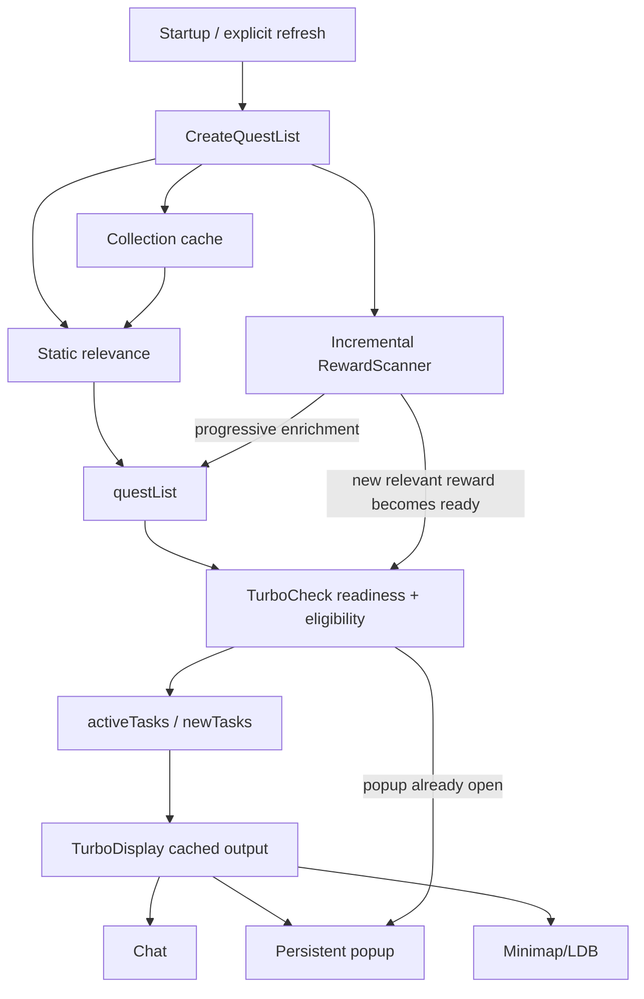

# WQA Turbo Developer Documentation

> **Documentation baseline:** `feature/popupandcontainers`, planned WQA Turbo **1.1.0**  
> **Previous public baseline:** 1.0.1  
> **Last major documentation refresh:** 2026-09-12

This directory is the canonical architectural and functional reference for WQA Turbo.

WQA Turbo is a performance-focused continuation of WQAchievements for World of Warcraft Retail. It discovers active World Quests and related tasks that are useful for configured goals such as achievements, collectibles, transmog, reputation, currencies, professions, gear, gold, and custom tracking.

The documentation is deliberately written for maintainers. It explains not only what the addon does, but **which module owns each behavior, how data flows between modules, what is safe to change, and what must not regress**.

## The most important architectural fact

WQA Turbo is not a clean-sheet rewrite of WQAchievements.

The repository still contains a large compatibility/core implementation in `WQATurbo.lua`, and several later-loaded Turbo modules replace or augment important methods with optimized implementations.

Therefore:

> **When tracing runtime behavior, TOC load order matters. The last loaded implementation of a method wins.**

Examples:

- `WQATurbo.lua` contains the legacy reward scan, while `RewardScanner.lua` supplies the optimized incremental runtime scanner.
- `WQATurbo.lua` contains a `CheckWQ()` implementation, while `TurboCheck.lua` supplies the optimized readiness/publication path.
- `WQATurbo.lua` contains display behavior, while `TurboDisplay.lua` adds the cache-first display/refresh split.
- `CollectionCache.lua` optimizes collectible collection-state access.
- `TurboRuntime.lua` replaces startup/runtime orchestration and command handling.

This rule should be the first thing checked when debugging a function that appears to behave differently from its implementation in `WQATurbo.lua`.

## Documentation map

| Document | Purpose |
|---|---|
| [ARCHITECTURE.md](ARCHITECTURE.md) | Module boundaries, load order, lifecycle, major data flows, runtime overrides |
| [SCANNING_AND_PERFORMANCE.md](SCANNING_AND_PERFORMANCE.md) | Incremental reward scanner, readiness, retries, collection caching, performance model |
| [FUNCTIONAL_REFERENCE.md](FUNCTIONAL_REFERENCE.md) | User-visible behavior and feature semantics |
| [DATA_MODEL.md](DATA_MODEL.md) | SavedVariables, runtime tables, reward/criteria/task models |
| [SETTINGS_REFERENCE.md](SETTINGS_REFERENCE.md) | Settings tree, option semantics, scope, refresh behavior |
| [FILE_MAP.md](FILE_MAP.md) | Repository-by-repository-file ownership reference |
| [DEVELOPMENT_GUIDE.md](DEVELOPMENT_GUIDE.md) | How to safely add data, reward rules, settings, criteria and features |
| [COMMANDS_AND_DIAGNOSTICS.md](COMMANDS_AND_DIAGNOSTICS.md) | Slash commands, scanner/perf diagnostics and debugging workflow |
| [RELEASE_AND_CI.md](RELEASE_AND_CI.md) | Validation, packaging, semantic versioning and CurseForge flow |
| [INVARIANTS_AND_REGRESSION_GUARDS.md](INVARIANTS_AND_REGRESSION_GUARDS.md) | Things future changes must not break |
| [KNOWN_LIMITATIONS.md](KNOWN_LIMITATIONS.md) | Current limitations, technical debt and research-only findings |
| [MAINTAINING_DOCUMENTATION.md](MAINTAINING_DOCUMENTATION.md) | Mandatory documentation-update rules and PR checklist |
| [VERSION_1.1.0.md](VERSION_1.1.0.md) | Planned 1.1.0 behavior delta |
| [ARCHITECTURE_FLOWS.md](ARCHITECTURE_FLOWS.md) | End-to-end sequence/data-flow traces |
| [API_AND_FUNCTION_INDEX.md](API_AND_FUNCTION_INDEX.md) | Maintainer index of important functions/runtime entry points |
| [TESTING_REFERENCE.md](TESTING_REFERENCE.md) | Functional/performance regression matrix |
| [DEPENDENCIES_AND_INTEGRATIONS.md](DEPENDENCIES_AND_INTEGRATIONS.md) | Embedded libraries, Blizzard APIs and optional addons |
| [GLOSSARY.md](GLOSSARY.md) | Project terminology |

## Quick mental model

The core design goal is:

> Static relevance becomes usable immediately. Slow Blizzard reward/item data enriches the same result set later without blocking every other quest.

## Source-of-truth hierarchy

When debugging or extending the addon:

1. **Current repository source** is authoritative.
2. Later-loaded Turbo overrides are authoritative over earlier compatibility implementations.
3. Blizzard APIs are authoritative for game state.
4. Static addon mappings are authoritative only for the specific mappings they define.
5. ATT and CanIMogIt are presentation integrations only for transmog; they are not collection-state authorities.
6. This documentation explains intent and architecture, but if code and documentation disagree, fix one of them in the same PR.

## Current release direction

The `feature/popupandcontainers` branch is intended to become **1.1.0**.

Its key changes are:

- Shift+Left-click on the minimap button opens the cached World Quest popup and starts a silent refresh.
- Dragonflight racing reward containers can be tracked.
- Nazjatar Benthic gear tokens are recognized by Armor Cache tracking.
- Azerite Armor Cache and generic equipment-cache toggles track the cache itself rather than silently behaving as upgrade-only filters.

See [VERSION_1.1.0.md](VERSION_1.1.0.md).
