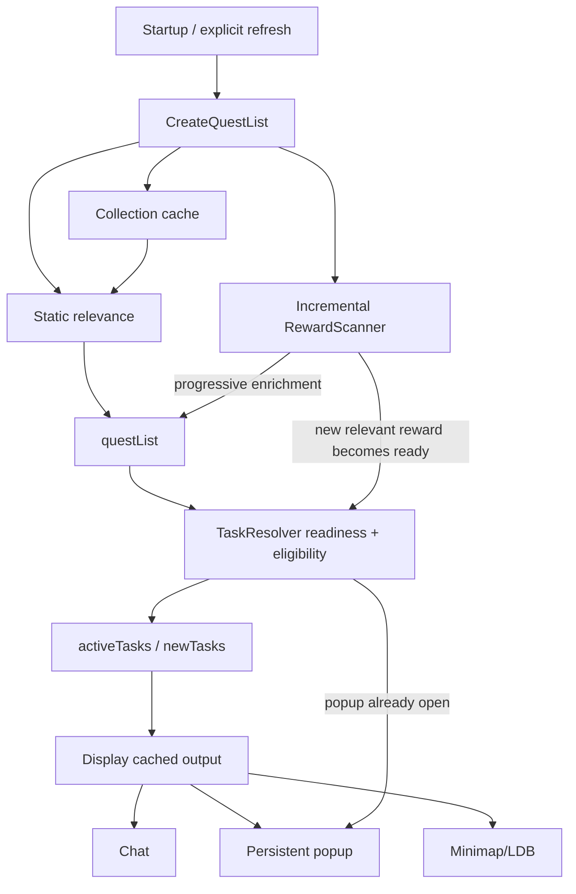

# WQA Turbo Developer Documentation

> **Documentation baseline:** WQA Turbo **1.5.2** / `master`
>
> **Behavioral baseline:** released WQA Turbo 1.5.2 behavior
>
> **Last major documentation refresh:** 2026-09-24

This directory is the canonical architectural and functional reference for WQA Turbo.

WQA Turbo is a performance-focused continuation of WQAchievements for World of Warcraft Retail. It discovers active World Quests and related tasks that are useful for configured goals such as achievements, collectibles, transmog, reputation, currencies, professions, gear, gold, and custom tracking.

The documentation is deliberately written for maintainers. It explains not only what the addon does, but **which module owns each behavior, how data flows between modules, what is safe to change, and what must not regress**.

## The most important architectural fact

WQA Turbo is not a clean-sheet rewrite of WQAchievements.

The repository still contains a large compatibility/core implementation in
`WQATurbo.lua`. Specialized modules own the performance-sensitive runtime
paths. Each consolidated runtime method has one source owner.

Therefore:

> **When tracing runtime behavior, start with the owning module and then check
> TOC load order for its dependencies and performance instrumentation.**

Examples:

- `Scanning/RewardScanner.lua` owns the incremental runtime reward scanner.
- `Scanning/WorldBossScanner.lua` owns opt-in Encounter Journal World Boss loot inspection.
- `Scanning/EmissaryScanner.lua` owns emissary discovery and readiness.
- `Runtime/TaskResolver.lua` owns readiness and final task publication.
- `Runtime/Display.lua` owns the cache-first display/refresh split.
- `Tracking/Custom.lua` owns custom task runtime registration.
- `Tracking/QuestAvailability.lua` owns Quest Pin and Quest Flag availability.
- `Tracking/CollectionCache.lua` owns collectible collection-state access.
- `Runtime/Runtime.lua` owns startup/runtime orchestration and command handling.
- `WQATurbo.lua` owns the `CreateQuestList()` rebuild.

The validator rejects missing or duplicate owners for these consolidated
runtime methods.

## Documentation map

| Document | Purpose |
|---|---|
| [ARCHITECTURE.md](ARCHITECTURE.md) | Module boundaries, load order, lifecycle, major data flows, runtime ownership |
| [SCANNING_AND_PERFORMANCE.md](SCANNING_AND_PERFORMANCE.md) | Incremental reward scanner, readiness, retries, collection caching, performance model |
| [FUNCTIONAL_REFERENCE.md](FUNCTIONAL_REFERENCE.md) | User-visible behavior and feature semantics |
| [DATA_MODEL.md](DATA_MODEL.md) | SavedVariables, runtime tables, reward/criteria/task models |
| [SETTINGS_REFERENCE.md](SETTINGS_REFERENCE.md) | Settings tree, option semantics, scope, refresh behavior |
| [FILE_MAP.md](FILE_MAP.md) | Repository-by-repository-file ownership reference |
| [DEVELOPMENT_GUIDE.md](DEVELOPMENT_GUIDE.md) | How to safely add data, reward rules, settings, criteria and features |
| [COMMANDS_AND_DIAGNOSTICS.md](COMMANDS_AND_DIAGNOSTICS.md) | Slash commands, scanner/perf diagnostics and debugging workflow |
| [RELEASE_AND_CI.md](RELEASE_AND_CI.md) | Validation, packaging, semantic versioning and CurseForge flow |
| [INVARIANTS_AND_REGRESSION_GUARDS.md](INVARIANTS_AND_REGRESSION_GUARDS.md) | Things future changes must not break |
| [KNOWN_LIMITATIONS.md](KNOWN_LIMITATIONS.md) | Current limitations, technical debt and research-only findings |
| [MAINTAINING_DOCUMENTATION.md](MAINTAINING_DOCUMENTATION.md) | Mandatory documentation-update rules and PR checklist |
| [VERSION_1.1.0.md](VERSION_1.1.0.md) | Historical 1.1.0 behavior delta |
| [VERSION_1.2.0.md](VERSION_1.2.0.md) | Completed refactor plan, validation and release preparation |
| [VERSION_1.5.1.md](VERSION_1.5.1.md) | Tested 1.5.1 patch scope and verification |
| [ARCHITECTURE_FLOWS.md](ARCHITECTURE_FLOWS.md) | End-to-end sequence/data-flow traces |
| [API_AND_FUNCTION_INDEX.md](API_AND_FUNCTION_INDEX.md) | Maintainer index of important functions/runtime entry points |
| [TESTING_REFERENCE.md](TESTING_REFERENCE.md) | Functional/performance regression matrix |
| [DEPENDENCIES_AND_INTEGRATIONS.md](DEPENDENCIES_AND_INTEGRATIONS.md) | Embedded libraries, Blizzard APIs and optional addons |
| [GLOSSARY.md](GLOSSARY.md) | Project terminology |
| [CURRENT_PATCH_AUDIT_1.3.0.md](CURRENT_PATCH_AUDIT_1.3.0.md) | Sourced Retail 12.1 map, faction, currency, profession and achievement audit |

## Quick mental model

The core design goal is:

> Static relevance becomes usable immediately. Slow Blizzard reward/item data enriches the same result set later without blocking every other quest.

## Source-of-truth hierarchy

When debugging or extending the addon:

1. **Current repository source** is authoritative.
2. Each consolidated runtime entry point has one source owner.
3. Blizzard APIs are authoritative for game state.
4. Static addon mappings are authoritative only for the specific mappings they define.
5. ATT and CanIMogIt are presentation integrations only for transmog; they are not collection-state authorities.
6. This documentation explains intent and architecture, but if code and documentation disagree, fix one of them in the same PR.

## Current release direction

Version **1.5.2** is released. The tested **1.7.0** release candidate adds World Boss transmog tracking on top of the 1.6.0 usability work. The
completed 1.2.0 refactor and verification
history remain in [VERSION_1.2.0.md](VERSION_1.2.0.md). See
[ROADMAP.md](ROADMAP.md) for follow-up work and research status.

The preserved **1.1.0** behavior includes:

- Shift+Left-click on the minimap button opens the cached World Quest popup and starts a silent refresh.
- Dragonflight racing reward containers can be tracked.
- Nazjatar Benthic gear tokens are recognized by Armor Cache tracking and hide
  when their appearance pool for the active character's armor type is complete.
- Dragonflight racing purses hide independently after their own manuscript
  pools are complete.
- Azerite Armor Cache uses a profile-wide master toggle, a per-character
  override and a verified current-armor appearance pool; generic equipment
  caches remain independent of obsolete upgrade value.

See [VERSION_1.1.0.md](VERSION_1.1.0.md).
